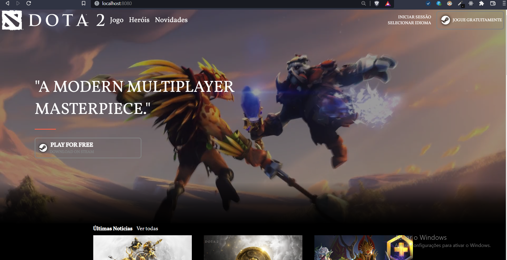
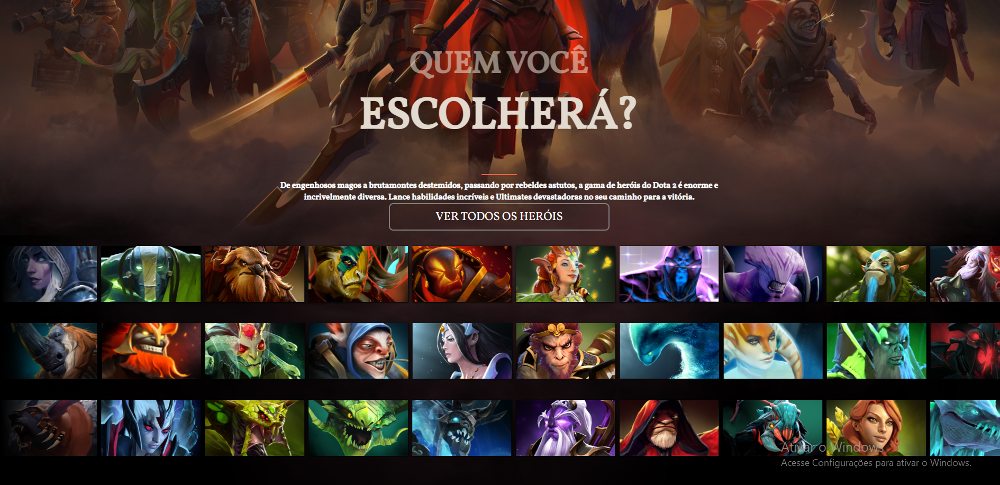

# Clone Website Dota 2




---

## Original site: [www.dota2.com](https://www.dota2.com/home)

---

## Project setup
```
npm install
```
### Compiles and hot-reloads for development
```
npm run serve
```

### Compiles and minifies for production
```
npm run build
```

### Lints and fixes files
```
npm run lint
```

### Customize configuration
See [Configuration Reference](https://cli.vuejs.org/config/).


<p align="center">
Development with: 
</p>
